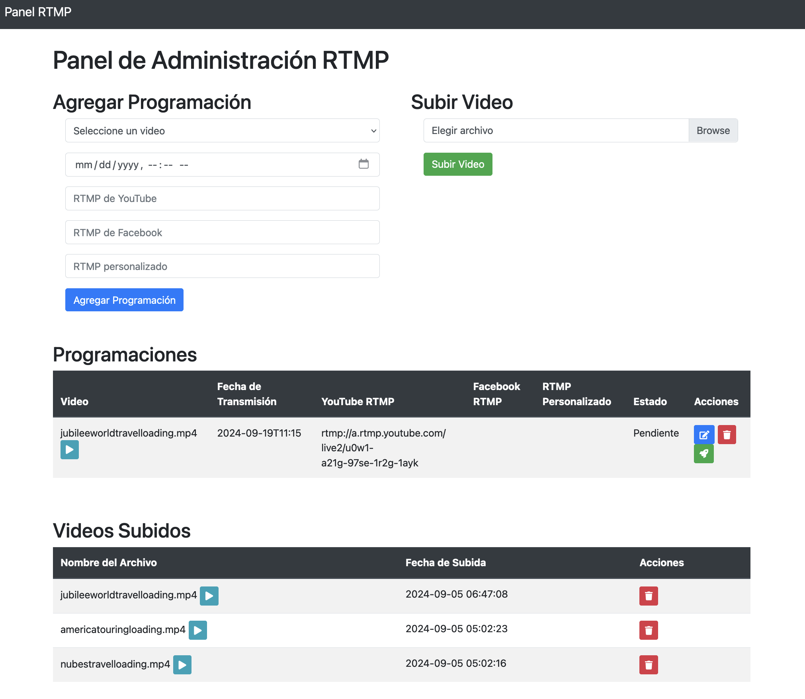

# RTMP Scheduler

Este script permite programar y ejecutar transmisiones RTMP automáticamente.

## Requisitos previos

- SQLite3
- FFmpeg
- Bash

## Instalación y configuración

1. Clona o descarga este repositorio en tu máquina local.

2. Asegúrate de que tienes instalado SQLite3 y FFmpeg en tu sistema.

3. Crea una base de datos SQLite llamada `rtmp_manager.db` en el mismo directorio que el script:

   ```bash
   sqlite3 rtmp_manager.db
   ```

4. Dentro de SQLite, crea la tabla `schedules` con la siguiente estructura:

   ```sql
   CREATE TABLE schedules (
     id INTEGER PRIMARY KEY AUTOINCREMENT,
     video_path TEXT,
     broadcast_time DATETIME,
     youtube_rtmp TEXT,
     facebook_rtmp TEXT,
     custom_rtmp TEXT,
     status TEXT
   );
   ```

   Luego, sal de SQLite con el comando `.quit`

5. Dale permisos de ejecución al script:

   ```bash
   chmod +x rtmp_scheduler.sh
   ```

## Configuración de Nginx con soporte RTMP

1. Instala Nginx con el módulo RTMP:

   ```bash
   sudo apt update
   sudo apt install nginx libnginx-mod-rtmp
   ```

2. Edita el archivo de configuración de Nginx:

   ```bash
   sudo nano /etc/nginx/nginx.conf
   ```

3. Agrega la siguiente configuración al final del archivo:

   ```nginx
   rtmp {
       server {
           listen 1935;
           chunk_size 4096;

           application live {
               live on;
               record off;

               push rtmp://youtube.com/live/your_youtube_key;
               push rtmp://facebook.com/live/your_facebook_key;
           }
       }
   }
   ```

4. Guarda el archivo y reinicia Nginx:

   ```bash
   sudo systemctl restart nginx
   ```

## Uso con Nginx

1. Modifica el script `rtmp_scheduler.sh` para transmitir a Nginx en lugar de directamente a las plataformas:

   ```bash
   # Reemplaza las líneas de FFmpeg con:
   ffmpeg -re -i "$video_path" -c copy -f flv rtmp://localhost/live/stream &
   ```

2. Programa las transmisiones en la base de datos como se indicó anteriormente, pero usa `rtmp://localhost/live/stream` como URL RTMP.

3. Ejecuta el script como se describió en la sección de uso.

4. Recuerda actualizar las claves de transmisión en la configuración de Nginx (`/etc/nginx/nginx.conf`) cada vez que cambies tus claves en YouTube o Facebook.

## Notas adicionales

- Asegúrate de que el puerto 1935 esté abierto en tu firewall.
- Reemplaza `your_youtube_key` y `your_facebook_key` con tus claves de transmisión reales.
- Puedes agregar más destinos `push` en la configuración de Nginx para transmitir a otras plataformas.
- Se recomienda ejecutar el script en segundo plano o como un servicio del sistema para que funcione continuamente.

## Monitoreo

- Revisa la salida del script para ver si hay errores o transmisiones iniciadas.
- Verifica la base de datos para ver el estado de las transmisiones programadas.

## Notas

- Asegúrate de que los archivos de video existen en las rutas especificadas.
- Verifica que las claves RTMP sean válidas para las plataformas que estés utilizando.
- El script limpiará automáticamente las transmisiones antiguas (más de 1 día).

## Contribuciones

Las contribuciones son bienvenidas. Por favor, abre un issue o un pull request para sugerir cambios o mejoras.

## Licencia

[MIT License](LICENSE)

## Ejecución del script

Para ejecutar el script, usa el siguiente comando:

```
./rtmp_scheduler.sh
```

## Screenshot



## Uso con Docker

1. Asegúrate de tener Docker instalado en tu sistema.

2. Crea un archivo `Dockerfile` en el directorio raíz del proyecto con el siguiente contenido:

   ```dockerfile
   FROM ubuntu:latest

   RUN apt-get update && apt-get install -y \
       sqlite3 \
       ffmpeg \
       nginx \
       libnginx-mod-rtmp

   COPY rtmp_scheduler.sh /app/rtmp_scheduler.sh
   COPY rtmp_manager.db /app/rtmp_manager.db
   COPY nginx.conf /etc/nginx/nginx.conf

   WORKDIR /app

   RUN chmod +x /app/rtmp_scheduler.sh

   CMD ["bash", "-c", "service nginx start && ./rtmp_scheduler.sh"]
   ```

3. Crea un archivo `nginx.conf` en el directorio raíz con la configuración de Nginx mencionada anteriormente.

4. Construye la imagen Docker:

   ```bash
   docker build -t rtmp-scheduler .
   ```

5. Ejecuta el contenedor:

   ```bash
   docker run -d --name rtmp-scheduler-container -p 1935:1935 rtmp-scheduler
   ```

6. Para ver los logs del contenedor:

   ```bash
   docker logs rtmp-scheduler-container
   ```

7. Para detener el contenedor:

   ```bash
   docker stop rtmp-scheduler-container
   ```

8. Para reiniciar el contenedor:

   ```bash
   docker start rtmp-scheduler-container
   ```

Nota: Asegúrate de que el archivo de base de datos `rtmp_manager.db` esté en el mismo directorio que el Dockerfile antes de construir la imagen.
